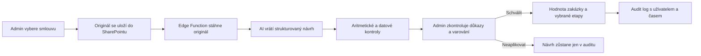

# AI vyčtení smlouvy do projektu a realizace

## Cíl

Smlouva se nahraje k projektu nebo realizaci do již propojeného SharePointu. AI z dokumentu připraví kontrolovatelný návrh ceny zakázky, DPH, splatnosti a fakturačních etap. Návrh nikdy automaticky nemění finance.

## Workflow



## Vyčítané údaje

- číslo a datum smlouvy,
- smluvní strany,
- cena bez DPH, sazba DPH a cena s DPH,
- měna,
- splatnost, záloha a zádržné,
- termín dokončení,
- platební etapy včetně podmínky, termínu, částky nebo procenta,
- krátký důkaz z ustanovení smlouvy a míra spolehlivosti.

Neznámé údaje se vrací jako `null`; model je nesmí odhadovat. Cizí měna se do hodnoty projektu nebo realizace automaticky nepřenese.

## Bezpečnost

- Funkce i databázové tabulky jsou dostupné pouze roli `admin`.
- `GEMINI_API_KEY` je pouze v Supabase secrets, nikdy ve frontendu.
- Poskytovatel je volitelný serverovým nastavením; OpenAI lze ponechat jako záložní variantu.
- Originál zůstává v SharePointu a jeho SHA-256 hash je uložen u analýzy.
- Finanční změna proběhne výhradně přes schvalovací RPC a zapíše se do `audit_logs`.
- AI výsledek je pomocný návrh, nikoliv právní nebo účetní posouzení smlouvy.

## Konfigurace

Supabase Edge Function vyžaduje secrets:

```text
CONTRACT_AI_PROVIDER=gemini
GEMINI_API_KEY
GEMINI_CONTRACT_EXTRACTION_MODEL=gemini-3.5-flash
MS_GRAPH_TENANT_ID
MS_GRAPH_CLIENT_ID
MS_GRAPH_CLIENT_SECRET
```

Volitelná záložní konfigurace pro OpenAI:

```text
OPENAI_API_KEY
OPENAI_CONTRACT_EXTRACTION_MODEL=gpt-5-mini
```

Před nasazením je nutné aplikovat migrace v pořadí:

1. `20260718113000_billing_milestones_and_invoice_documents.sql`
2. `20260718121500_contract_ai_extraction.sql`

Poté nasadit Edge Function `analyze-contract`.

## Serverové tajemství

Gemini i případný OpenAI klíč patří pouze do Supabase Edge Function secrets. Nesmí být ve `.env` frontendu,
zdrojovém kódu, migraci ani v Git historii.

```powershell
supabase secrets set CONTRACT_AI_PROVIDER=gemini
supabase secrets set GEMINI_API_KEY
supabase secrets set GEMINI_CONTRACT_EXTRACTION_MODEL=gemini-3.5-flash
```

OpenAI záložní workflow používá `store: false`. Jeden identický soubor u stejného projektu nebo
realizace se podle SHA-256 neposílá modelu opakovaně.

## Schválení návrhu

1. Administrátor nahraje originál do SharePointu a spustí analýzu.
2. AI vrátí návrh ceny, DPH, splatnosti a fakturačních etap včetně důkazů a spolehlivosti.
3. Etapy bez důkazu, bez částky nebo se spolehlivostí pod 80 % nejsou předvybrané.
4. Administrátor vybere použitelné etapy a návrh schválí, nebo jej zamítne s důvodem.
5. Teprve schválení zavolá databázové RPC a změní hodnotu zakázky či vytvoří etapy.
6. Analýza, jednotlivé revize etap, schválení i zamítnutí jsou uloženy v `audit_logs`.
