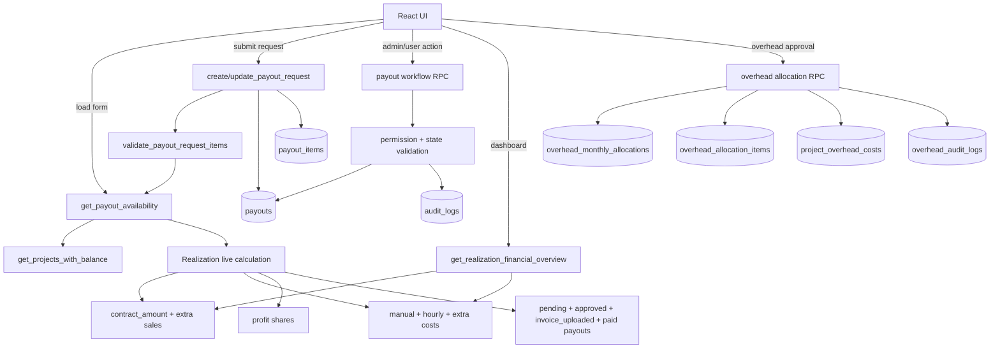
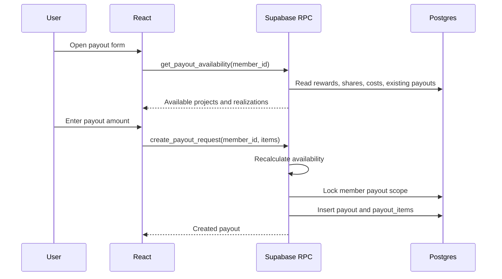

# Financial Backend Migration Diagram

Date: 2026-05-13

## Current Target

The financial rules should be owned by backend RPC functions. The frontend should only collect user input, show backend-calculated values, and send requested actions.

This matters most for payouts because a user can already have money requested, approved, uploaded for invoice, or paid on the same project or realization. Those amounts must reduce the available balance before a new payout can be created.

## Implemented In This Step

- `get_payout_availability(member_id, edit_payout_id)` calculates project and realization payout availability in the backend.
- `create_payout_request(...)` validates and writes payout header and items atomically.
- `update_payout_request(...)` validates and replaces payout items atomically.
- `approve_payout(...)`, `reject_payout(...)`, `upload_payout_invoice(...)`, `mark_payout_paid(...)`, and `delete_payout_request(...)` own payout workflow state changes.
- `get_realization_financial_overview()` returns realization dashboard totals from backend-calculated live costs.
- `set_overhead_allocation_status(...)`, `approve_overhead_allocation(...)`, and `reopen_overhead_allocation(...)` own overhead allocation status changes and accounting writes.
- `PayoutDialog`, `payoutRequestService`, `PayoutApprovalService`, `payoutWorkflowService`, and `Payouts` now call RPC functions for payout writes.
- `RealizaceFinancials` now calls backend overview instead of calculating aggregate totals in React.
- `AllocationWorkflow` now calls backend RPC for approval/reopen/status changes instead of deleting and inserting `project_overhead_costs` directly.

## Payout Availability Formula

```text
realization_revenue = contract_amount + extra_sale_amount
realization_costs = manual_costs + hourly_costs + extra_costs
profit = realization_revenue * profit_margin_percent / 100
overhead = realization_revenue * overhead_percent / 100
team_budget = realization_revenue - profit - overhead - realization_costs

member_total_share =
  fixed share
  OR team_budget * percentage_share / 100

reserved_or_paid =
  payout_items.amount where payout status is pending, approved, invoice_uploaded, or paid

available_share = max(0, member_total_share - reserved_or_paid)
```

The important rule is that money already requested or paid is counted against the available amount. It is treated as a payout ledger deduction, not as a normal `realizace_costs` or `project_costs` row.

## Backend-Owned Flow



## Sequence For Creating A Payout



## Remaining Migration Steps

1. Apply and test the migration against Supabase.
2. Add database-level test cases for payout over-request, edit mode, and concurrent requests.
3. Add database-level test cases for overhead approval, reopen, duplicate prevention, and invalid status transitions.
4. Add detailed `project_financial_summary(project_id)` and `realization_financial_summary(realization_id)` read models.
5. Replace remaining frontend financial previews with backend read models where the value is used for decisions.
6. Keep frontend helpers only for formatting, lightweight previews, and immediate form feedback.
