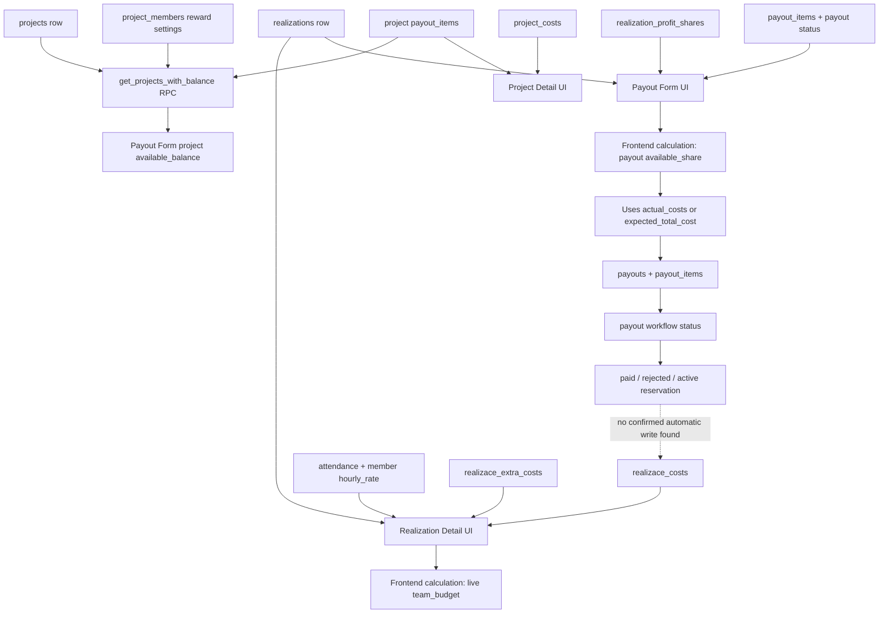
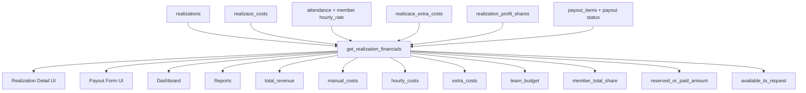

# Financial Calculation Backend Plan

Date: 2026-05-13

## Purpose

This document describes the current financial calculation flow, the observed inconsistencies between frontend and backend logic, and a practical migration plan toward backend-owned financial calculations.

The goal is to make payouts, realization detail screens, dashboards, and reports use the same financial source of truth.

## Executive Summary

The current application has multiple calculation paths for the same business concepts:

- realization team budget
- member available payout balance
- project available payout balance
- paid/requested payout totals
- manual, hourly, and extra costs
- dashboard/reporting totals

Some of these calculations happen in React components, some in `src/domain/financials.js`, some in Supabase RPC routines, and some appear to depend on legacy snapshot columns such as `actual_costs`, `expected_total_cost`, or `realizace_financials`.

This is risky because the UI may show one financial result while the payout workflow validates another.

## Current Calculation Sources

### Frontend Domain Helpers

File: `src/domain/financials.js`

Key functions:

- `calculateProjectBudget`
- `calculateProjectFinancials`
- `calculateRealizationFinancials`
- `calculateRealizationMemberShare`
- `calculateRealizationMemberAvailableShare`

Realization formula:

```text
profit_amount = contract_amount * profit_margin_percent / 100
overhead_amount = contract_amount * overhead_percent / 100
gross_project_budget = contract_amount - profit_amount - overhead_amount
team_budget = gross_project_budget - total_costs
```

Member availability formula:

```text
member_total_share = fixed_share OR team_budget * share_percent / 100
available_share = max(0, member_total_share - paid_or_reserved_amount)
```

### Realization Detail Screen

File: `src/components/RealizaceDetail.jsx`

The detail screen calculates total realization cost from live operational tables:

```text
manual_costs = sum(realizace_costs.amount)
hourly_costs = sum(attendance.hours * members.hourly_rate)
extra_costs = sum(realizace_extra_costs.cost_amount)
extra_revenue = sum(realizace_extra_costs.sale_amount)

total_revenue = realizations.contract_amount + extra_revenue
total_costs = manual_costs + hourly_costs + extra_costs
team_budget = total_revenue - profit - overhead - total_costs
```

This is the most complete current frontend model for realization detail.

### Payout Form For Realizations

File: `src/components/PayoutDialog.jsx`

The payout form calculates available realization balance differently:

```text
total_costs = actual_costs || expected_total_cost
team_budget = contract_amount - profit - overhead - total_costs
member_total_share = fixed_share OR team_budget * share_percent / 100
reserved_or_paid = sum(payout_items.amount where payout status is pending, approved, invoice_uploaded, paid)
available_share = max(0, member_total_share - reserved_or_paid)
```

This means payout availability can differ from the realization detail screen.

Important detail: the payout form correctly reserves amounts from all active payout states:

```text
pending
approved
invoice_uploaded
paid
```

This prevents duplicate payout requests before money is actually paid.

### Payout Persistence

File: `src/lib/payoutRequestService.js`

Creating a payout request writes to:

```text
payouts
payout_items
```

The code does not show an automatic insert into:

```text
project_costs
realizace_costs
```

Marking a payout as paid updates the payout status and `paid_at`, but does not appear to create a normal cost record.

### Project Detail

File: `src/components/ProjectDetail.jsx`

Project detail fetches paid payout items and displays them as a derived finance row named "Vyplacene penize". It does not appear to store paid payouts as `project_costs`.

This is acceptable if payouts are modeled as payout ledger entries, but it must be consistent everywhere.

### Project Payout Availability

Backend RPC: `get_projects_with_balance`

Live data verification on 2026-05-13 confirmed that project payouts are already considered by the project balance RPC.

Example:

```text
project: FVE 400kWp, Mantov / OP-25-094
member: Ing. Jan Kopacka
total_reward: 82,140
paid_amount: 40,000
available_balance: 42,140
```

This means the project payout flow currently behaves like:

```text
available_balance = total_reward - paid_amount
```

The important distinction is that the paid payout is included in the balance calculation through `payout_items` and the RPC result. It was not observed as an automatic ordinary cost row in `project_costs`.

For the same checked project, `project_costs` contained an attendance cost row, but not the `40,000` payout as a normal project cost.

Therefore, "payout is counted" currently means:

```text
counted as a payout ledger deduction from member/project availability
```

not necessarily:

```text
posted into project_costs as a normal cost item
```

## Example: OP-26-069

Verified against live Supabase data on 2026-05-13.

Realization:

```text
id: 55462f29-056b-49cb-8f3b-97a2c809a2f3
name: OP-26-069
contract_amount: 2,808,213
expected_total_cost: 1,663,800
actual_costs: 0
profit_margin_percent: 15
overhead_percent: 5
status: Pripravuje se
```

Live operational costs:

```text
realizace_costs: 700,000
realizace_extra_costs: 0
attendance cost: 0
```

Detail screen calculation:

```text
profit = 2,808,213 * 15% = 421,232
overhead = 2,808,213 * 5% = 140,411
team_budget = 2,808,213 - 421,232 - 140,411 - 700,000
team_budget = 1,546,570
```

Payout-form style calculation:

```text
total_costs = actual_costs || expected_total_cost
total_costs = 1,663,800

team_budget = 2,808,213 - 421,232 - 140,411 - 1,663,800
team_budget = 582,770
```

For `Ing. Pavel Kopacka` on this realization:

```text
realization_profit_shares: none
payout_items: none
available_share: 0
```

In this specific case, `0` is caused by missing member share, not by already paid money.

However, the detail screen and payout form still calculate different realization team budgets because they use different cost bases.

## Current Flow Diagram



## Target Flow Diagram



## Recommended Backend Contract

### `get_realization_financials(p_realization_id uuid)`

Returns one row:

```text
realization_id
contract_amount
extra_revenue
total_revenue
manual_costs
hourly_costs
extra_costs
total_costs
profit_margin_percent
profit_amount
overhead_percent
overhead_amount
team_budget
```

### `get_realization_member_balance(p_realization_id uuid, p_member_id uuid)`

Returns one row:

```text
realization_id
member_id
team_budget
share_type
share_value
member_total_share
reserved_pending_amount
approved_amount
invoice_uploaded_amount
paid_amount
reserved_or_paid_amount
available_to_request
```

### `get_member_payout_options(p_member_id uuid)`

Returns all payout options for one member:

```text
source_type -- project | realization
source_id
source_name
source_code
source_status
member_total_share
reserved_or_paid_amount
available_to_request
explanation
```

The `explanation` field should make the UI transparent:

```text
No share configured
Fully reserved by pending payout
Fully paid
Available
Negative team budget
Closed/locked
```

## Key Design Decision

Payouts should not be silently duplicated as normal costs unless the accounting model explicitly requires it.

The current project flow already counts paid project payouts in member/project availability via `get_projects_with_balance`. That is different from posting the payout into `project_costs`.

The realization flow should be made explicit and consistent with the project flow:

```text
available payout balance should subtract reserved/paid payout_items
```

while separately deciding whether paid payout items are accounting costs.

There are two valid models:

### Model A: Payout Ledger Only

Payouts stay in:

```text
payouts
payout_items
```

They are included in financial summaries as payout ledger entries.

They are not inserted into:

```text
project_costs
realizace_costs
```

They are still counted in payout availability through backend balance functions. This avoids double counting while still preventing duplicate payout requests.

### Model B: Payouts Become Costs

When a payout becomes `paid`, the backend creates a linked cost record:

```text
realizace_costs.source_type = payout
realizace_costs.source_id = payout_item.id
```

or:

```text
project_costs.source_type = payout
project_costs.source_id = payout_item.id
```

This requires idempotency and a unique constraint so the same payout item cannot be posted twice.

If Model B is chosen, payout availability must not also subtract the same paid amount from a team budget that already includes the cost record, unless the formulas are deliberately adjusted. Otherwise paid payouts will be double counted.

Recommended model: start with Model A. It is safer and closer to the current code and the observed `get_projects_with_balance` behavior.

If accounting later requires Model B, implement it deliberately with explicit source columns and reconciliation rules, not by manual duplicate entry.

## Implementation Plan

### Step 1: Freeze The Current Rules

Document and approve these business rules:

- Does a payout reduce only a member's available share?
- Does a paid payout also reduce project/realization profit as a cost?
- Are pending and approved payouts reservations? Current code says yes.
- Should project payouts continue to behave like the observed RPC model: `available_balance = total_reward - paid_amount`?
- Should expected cost be used only before real costs exist?
- Should realization extra work sale increase the basis for profit/overhead?
- Can profit plus overhead exceed 100%? It should not.

Output:

- signed-off calculation rules
- examples for fixed share, percentage share, partial payout, full payout, over-budget realization

### Step 2: Build Backend Read Models

Add SQL functions or views:

- `get_realization_financials`
- `get_realization_member_balance`
- `get_member_payout_options`
- optionally replace or document `get_projects_with_balance`

Use live operational tables, not stale snapshot columns, unless explicitly marked as forecast.

For projects, preserve the already-observed behavior:

```text
total_reward
paid_amount
available_balance
```

For realizations, implement the same clarity:

```text
member_total_share
reserved_or_paid_amount
available_to_request
```

Output:

- migration with `CREATE OR REPLACE FUNCTION`
- local SQL comments explaining every returned field
- indexes if queries need them

### Step 3: Add Backend Validation

Add backend validation for payout creation:

- requested amount must be positive
- requested amount must be <= backend `available_to_request`
- member must have a configured share/assignment
- source must not be financially locked
- status must allow new payout

Do not rely on frontend validation only.

Output:

- RPC such as `create_payout_request`
- or database trigger/check function around `payout_items`

### Step 4: Switch Payout Form To Backend Options

Replace the current frontend calculation in `PayoutDialog.jsx` with backend output from `get_member_payout_options`.

The frontend should display:

```text
available_to_request
member_total_share
reserved_or_paid_amount
explanation
```

Output:

- payout form no longer calculates realization availability locally
- `0 Kc` entries explain why they are zero

### Step 5: Switch Realization Detail To Backend Financials

Replace local aggregation in `RealizaceDetail.jsx` with `get_realization_financials`.

Keep local calculations only as temporary optimistic UI for unsaved form edits.

Output:

- realization detail and payout form agree for the same realization
- finance cards show backend values

### Step 6: Switch Dashboard And Reports

Update:

- `Dashboard.jsx`
- `RealizaceFinancials.jsx`
- `RealizaceFinancialChart.jsx`
- `RealizaceFinancialTable.jsx`
- report modules

to use backend financial read models.

Output:

- dashboard totals are generated from the same source as detail and payouts
- legacy `realizace_financials` usage is either removed or clearly labeled as historical/snapshot data

### Step 7: Add Tests

Add a small deterministic financial test set.

Recommended test scenarios:

1. No costs, no shares.
2. Manual cost only.
3. Manual + hourly + extra costs.
4. Percent share with no payouts.
5. Percent share with pending payout.
6. Percent share with paid payout.
7. Fixed share with partial payout.
8. Negative team budget.
9. Profit + overhead over 100%.
10. Extra revenue changes total revenue.

Output:

- SQL test fixture or JS integration test against local Supabase
- frontend smoke test that verifies visible UI fields match backend response

### Step 8: Add Financial Locking

Introduce locking for closed periods or completed realizations.

Example:

```text
financial_locked_at
financial_locked_by
financial_lock_reason
```

Once locked:

- costs cannot be edited without admin override
- payout shares cannot be changed without audit
- status changes require permission

Output:

- auditable financial close process

## Migration Risk Checklist

- Avoid changing live payout balances without a reconciliation report.
- Export current payout, cost, and share tables before migration.
- Compare old vs new calculations for every active project and realization.
- Flag differences above a threshold, for example `1 Kc`.
- Do not auto-post paid payouts into costs unless double counting is resolved.
- Keep old frontend calculations temporarily behind debug comparison logs.

## Immediate Next Actions

1. Create SQL baseline of production schema, because current repo does not contain full `CREATE FUNCTION` definitions for live RPC routines.
2. Build `get_realization_financials` as a read-only backend function.
3. Build `get_realization_member_balance` for one realization/member.
4. Compare backend result with `RealizaceDetail.jsx` for `OP-26-069`.
5. Replace the realization part of `PayoutDialog.jsx` with the backend result.
6. Add UI explanations for zero balances.
7. Add tests for pending/approved/paid payout reservation logic.
