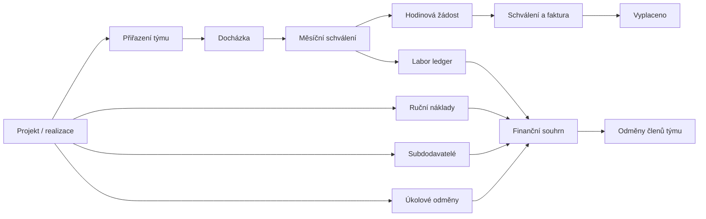
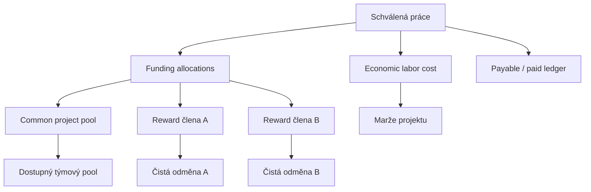
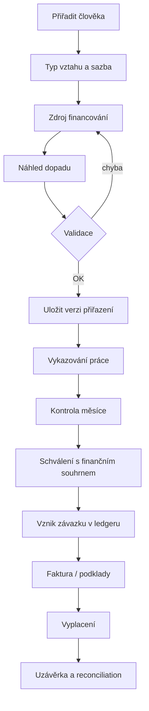

# Kompletní audit finančních procesů EKVPortal

Datum: 12. 7. 2026  
Rozsah: Projekty, realizace, týmy, docházka, hodinové mzdy, úkolové odměny, výplaty, náklady, audit a reporting.

## Stav nápravy před rolloutem (12. 7. 2026)

Kritické body P0/P1 z tohoto auditu jsou pokryté migracemi
`20260712173000` až `20260712182000`: privátní kompenzační tabulka, admin-only
globální finance, historický pracovní ledger, hodinová výplata ze snapshotů,
atomické podíly realizace a sloupcová ochrana finančních hodnot v REST API.
Detaily nasazení a omezení jsou v `FINANCIAL_ROLLOUT_RUNBOOK_2026-07-12.md`.

## 1. Manažerské shrnutí

Portál již obsahuje většinu potřebných stavebních bloků, ale finanční model se historicky vyvíjel ve více paralelních vrstvách. Stejná částka proto může být odvozena frontendovým výpočtem, starším RPC a novým ledgerem. Největší riziko není chybějící funkce, ale rozdílná interpretace pojmů `náklad`, `odměna`, `rezervace`, `výplata` a `marže`.

Před produkční aplikací nové migrace je nutné vyřešit čtyři blokující nálezy:

1. `realizace_costs` dovoluje zápis každému přihlášenému uživateli.
2. Hodinová výplata se stále vytváří z aktuální sazby v `members`, ne ze schválených ledger snapshotů.
3. Ekonomický náklad práce a interní zdroj financování jsou smíchány do jedné částky `project_cost_impact`.
4. Ukládání podílů realizace používá neatomický postup `DELETE` a následný `INSERT`.

Celkové hodnocení:

| Oblast | Stav | Skóre |
|---|---|---:|
| Integrita výpočtů | rozpracovaná konsolidace | 5/10 |
| Auditovatelnost | dobrý základ, neúplné pokrytí | 6/10 |
| Oprávnění a RLS | jeden kritický otvor | 4/10 |
| Docházka a hodinové mzdy | funkční workflow, rozdílný zdroj sazby | 6/10 |
| Výplaty a rezervace | pokročilé, příliš mnoho stavových implementací | 6/10 |
| UI/UX financí | informačně bohaté, málo hierarchické | 5/10 |
| Přístupnost a chybové stavy | částečně řešené | 6/10 |

## 2. Současná architektura



Aktuálně existují tři výpočetní vrstvy:

- frontendové helpery v `src/domain/financials.js`,
- starší souhrnné RPC `project_financial_summary` a `realization_financial_summary`,
- nový `labor_cost_ledger` a navazující read modely.

Dokud nebude jedna vrstva autoritativní, budou frontendové korekce typu „odečti legacy hourly a přičti ledger direct cost“ nutné a křehké.

## 3. Nálezy podle závažnosti

### P0 – blokující

#### P0.1 RLS dovoluje každému přihlášenému měnit náklady realizace

Baseline politika `Allow authenticated to manage realizace costs` povoluje všechny operace každému uživateli s rolí `authenticated`. Frontend navíc zapisuje přímo do tabulky.

Dopad:

- neoprávněná změna nebo smazání nákladů,
- změna marže a týmového rozpočtu,
- nedostatečná dohledatelnost původu změny.

Doporučení:

- zrušit obecnou manage policy,
- SELECT řídit oprávněním `realizace.can_read`,
- INSERT/UPDATE přes `save_realization_cost_safe`,
- DELETE nahradit reverzací přes `reverse_realization_cost_safe`,
- povolit editaci pouze `realizace.can_edit` nebo finančnímu adminovi.

#### P0.2 Výplata používá jinou hodinovou sazbu než schválený náklad

Nový ledger vybírá sazbu podle data práce z `member_hourly_rate_history`. Funkce vytvářející hodinovou žádost však načítá `members.hourly_rate` a násobí jí celý měsíc.

Příklad:

- 1.–15. 6.: 400 Kč/h, 40 hodin,
- 16.–30. 6.: 500 Kč/h, 40 hodin,
- správná výplata: 36 000 Kč,
- pokud je aktuální sazba 500 Kč/h, žádost vytvoří 40 000 Kč.

Doporučení: hodinová žádost musí agregovat `labor_cost_ledger.pay_amount`, nikoli `attendance.hours × members.hourly_rate`.

#### P0.3 Ekonomická marže je zaměněna za dopad do týmového poolu

Práce hrazená z odměny člena týmu má `project_cost_impact = 0`. To je správné pro výpočet společného poolu, ale ne pro ekonomickou marži projektu. Reálně vyplacená mzda pracovníka je vždy náklad zakázky; sponzorování pouze určuje, z které interní odměny je kryta.

Je nutné oddělit:

- `economic_labor_cost = employer_cost`,
- `common_pool_impact`,
- `member_reward_deduction`,
- `cash_paid`.

Jinak může projekt vypadat ziskověji, než ve skutečnosti je.

#### P0.4 Uložení podílů realizace není atomické

`RealizaceProfitSharing.jsx` nejdřív smaže všechny podíly a potom vloží nové. Pokud INSERT selže, realizace zůstane bez podílů.

Doporučení: RPC `replace_realization_profit_shares` v jedné transakci, s validací součtu, zamknutím realizace a auditním záznamem.

### P1 – vysoká priorita

#### P1.1 Přímé zápisy obcházejí doménovou vrstvu

Realizační tým, náklady a podíly se zapisují přímo z React komponent. Projektová část již používá bezpečná RPC, ale realizace ne.

Dopad: nekonzistentní oprávnění, audit, validační pravidla a souběh změn.

#### P1.2 Fyzické mazání finančních záznamů

Ruční náklady a týmová přiřazení lze fyzicky odstranit. U uzavřeného období se tím zpětně změní historická marže.

Cílově používat:

- `reversed_at`, `reversed_by`, `reversal_reason`,
- protizápis nebo novou verzi,
- fyzický DELETE pouze pro technický koncept bez návazností.

#### P1.3 Chybí uzávěrka období

Systém má stavy schválení, ale nemá obecnou finanční uzávěrku měsíce. Po účetním zpracování musí být změna možná jen korekcí v novém období.

#### P1.4 Jeden pracovník nemůže být rozdělen mezi více odměn členů

Současný návrh podporuje jednoho financujícího člena a zbytek projektu. Auditní cílový model počítá s více alokacemi.

Doporučení: tabulka `labor_assignment_allocations` s více řádky a součtem do 100 %.

#### P1.5 Deficit člena se pouze ořízne na nulu

Když práce podřízených převýší odměnu člena, UI ukáže deficit, ale datový model neurčuje jeho vypořádání.

Je nutné konfigurovat politiku:

- převést deficit na projekt,
- přenést do dalšího období,
- vytvořit pohledávku za členem,
- zablokovat schválení ještě před vznikem deficitu.

Výchozí doporučení: varování při 80 %, blokace nad 100 % bez schválení finančním administrátorem.

#### P1.6 Historická platnost přiřazení není skutečně verzovaná

Unikátní vazba `(project_id, member_id)` dovoluje jen jeden řádek. Změna data nebo sponzora přepisuje přiřazení; audit sice zachová JSON, ale běžný dotaz nedokáže pohodlně rekonstruovat stav.

Doporučení: assignment jako hlavička + immutable assignment revisions.

#### P1.7 Překryv sazeb není databázově zakázán

`member_hourly_rate_history` má unikátní `valid_from`, ale ne exclusion constraint proti překrývajícím se intervalům.

#### P1.8 Faktury používají veřejnou URL

Realizační náklad ukládá soubor a získává `getPublicUrl`. Finanční doklady mají být v privátním bucketu a otevírány krátkodobým signed URL.

### P2 – střední priorita

#### P2.1 Terminologie je nekonzistentní

V UI se střídá mzda, odměna, podíl, výplata, náklad a budget. Ne vždy je jasné, zda hodnota znamená plán, akruální závazek, rezervaci nebo zaplacenou částku.

#### P2.2 UI stále popisuje staré pravidlo

Projekt uvádí, že hodinové mzdy vstupují do nákladů až ve stavu `paid`. Nový ledger je ale akruálně eviduje při schválení docházky.

#### P2.3 Technické chyby se zobrazují uživateli

Řada toastů používá přímo `error.message`. Uživatel tak vidí názvy sloupců, RPC nebo schema cache místo instrukce k nápravě.

#### P2.4 Fallback skrývá backendovou poruchu

Pokud finanční RPC selže, UI tiše použije lokální legacy výpočet. Stránka vypadá funkčně, ale částky mohou být jiné než ve výplatách.

Doporučení: finance zobrazit jako „data nejsou ověřena“, zakázat destruktivní finanční akce a logovat incident.

#### P2.5 Komponenty jsou příliš rozsáhlé

`ProjectDetail`, `Attendance`, `AttendanceReporting` a další obsahují načítání, doménový výpočet i UI. To komplikuje testování a zvyšuje riziko regresí.

#### P2.6 Chybí optimistic concurrency

Dva administrátoři mohou upravit tým nebo finance současně. Potřebné je `version`/`updated_at` porovnání v RPC.

#### P2.7 Měna je deklarovaná, ale bez FX modelu

Ledger má `currency`, zbytek projektových částek předpokládá CZK. Bez směnného kurzu nelze bezpečně agregovat různé měny.

#### P2.8 Zaměstnanec a externista nemají oddělené nákladové zacházení

Chybí explicitní `engagement_type`: zaměstnanec, DPP/DPČ, OSVČ, subdodavatel. Employer burden, faktura a DPH se musí řídit typem vztahu.

## 4. UI/UX audit

### 4.1 Informační architektura

Projektový detail zobrazuje velké množství stejně výrazných finančních karet. Uživatel obtížně rozpozná, co je:

- obchodní hodnota,
- skutečný náklad,
- plánovaná rezerva,
- odměna týmu,
- již zaplacené cash-flow.

Doporučená struktura finanční záložky:

1. **Výnosy** – smlouva, vícepráce, fakturace.
2. **Ekonomické náklady** – materiál, subdodávky, práce, režie.
3. **Interní odměny** – hrubé podíly, odečty podřízených, čisté odměny.
4. **Cash-flow** – rezervováno, čeká na fakturu, splatné, zaplaceno.
5. **Rizika** – deficit, chybějící sazba, nezatříděná práce, překročení budgetu.

### 4.2 Přiřazení člověka

Dialog musí před uložením ukázat dopad:

| Náhled | Hodnota |
|---|---:|
| Odhad hodin | 40 h |
| Sazba | 500 Kč/h |
| Ekonomický náklad | 20 000 Kč |
| Z odměny Jana | 16 000 Kč |
| Z projektu | 4 000 Kč |
| Zůstatek Janovy odměny | 34 000 Kč |

Při změně existujícího přiřazení UI musí zobrazit datum účinnosti a upozornit, že schválená historie se nemění.

### 4.3 Detail člena týmu

Místo dlouhého textu v jednom řádku zobrazit kompaktní finanční rozpad:

- Hrubá odměna
- Běžné přiřazené náklady
- Práce podřízených
- Rezervované výplaty
- Vyplaceno
- Dostupné
- Deficit

### 4.4 Docházka a schválení

Schvalovatel potřebuje v detailu každého řádku vidět:

- projekt/realizaci,
- zdroj financování,
- použitou sazbu,
- hrubou mzdu,
- employer cost,
- člena, z jehož odměny se částka odečte,
- varování při překročení odměny.

Schválení měsíce je finanční událost, proto dialog musí obsahovat souhrn dopadu a ne pouze počet hodin.

### 4.5 Výplaty

Úkolové a hodinové výplaty mají mít stejný stavový model:

`draft → pending → approved → invoice_required/invoice_uploaded → payable → paid`

Stavová lišta má ukázat, kdo a kdy provedl poslední krok a co chybí k pokračování.

### 4.6 Chybové stavy

Místo databázové zprávy:

> column X does not exist

zobrazit:

> Finanční data se nepodařilo ověřit. Částky proto nejsou dostupné a nelze vytvořit výplatu. Kód incidentu FIN-READ-01.

Technický detail zůstane v logu pro administrátora.

### 4.7 Responzivita a hustota

- Finanční karty omezit na 4 hlavní KPI.
- Další hodnoty přesunout do plnošířkové tabulky.
- Na notebooku používat sticky první sloupec a interní horizontální scroll.
- Na mobilu nepřevádět komplexní tabulku na miniaturní buňky; použít řádkové detailní panely.

### 4.8 Přístupnost

- Každé ikonové tlačítko musí mít `aria-label` a tooltip.
- Stav nesmí být sdělen pouze barvou.
- Tabulky musí mít popisek a správné hlavičky.
- Po chybě přesunout fokus na souhrn chyby.
- Částky používat `tabular-nums` a jednotné formátování měny.

## 5. Doporučený cílový datový model

### 5.1 Oddělení ekonomiky, alokace a cash-flow



### 5.2 Doporučené entity

#### `work_assignments`

- scope type/id,
- worker member,
- engagement type,
- valid_from/to,
- status/version.

#### `work_assignment_allocations`

- assignment revision,
- funding source `project_pool | member_reward | overhead`,
- sponsor assignment/member,
- allocation percent,
- valid_from/to.

#### `member_rate_versions`

- pay rate,
- employer burden,
- currency,
- engagement type,
- nepřekrývající se platnost.

#### `labor_cost_ledger`

- pay amount,
- employer cost,
- economic project cost,
- pool impact,
- reward deductions,
- posting period,
- source hash/version,
- stav a reverzace.

#### `financial_periods`

- měsíc,
- stav open/soft_closed/closed,
- closed_by/at,
- povolený correction period.

## 6. Autoritativní pravidla výpočtu

Pro jednu docházkovou položku:

```text
pay_amount = hours × historical_pay_rate
employer_cost = pay_amount × (1 + employer_burden_percent / 100)
economic_project_cost = employer_cost
member_deduction_i = employer_cost × allocation_percent_i / 100
common_pool_impact = employer_cost - sum(member_deduction_i) - overhead_allocation
```

Pro člena týmu:

```text
gross_reward = fixed_reward OR reward_base × reward_percent
net_reward = gross_reward
             - assigned_manual_costs
             - sponsored_labor_deductions
             - reserved_or_paid_reward_payouts
```

Pro ekonomickou marži:

```text
economic_margin = recognized_revenue
                  - material_costs
                  - subcontractor_costs
                  - economic_labor_costs
                  - allocated_overhead
                  - commissions
```

Interní přesun mezi společným poolem a odměnou člena nesmí měnit `economic_margin`.

## 7. Backendová cílová architektura

### Write model

Všechny finanční změny přes RPC:

- `save_work_assignment`
- `replace_work_assignment_allocations`
- `approve_attendance_month`
- `create_hourly_payout_from_ledger`
- `replace_realization_profit_shares`
- `save_realization_cost`
- `reverse_realization_cost`
- `close_financial_period`

Každé RPC:

1. ověří roli a scope,
2. zamkne dotčený projekt/měsíc,
3. zkontroluje verzi,
4. provede validace,
5. zapíše změnu a audit v jedné transakci,
6. vrátí nový autoritativní souhrn.

### Read model

Jedna sada read modelů:

- `project_financial_position`
- `realization_financial_position`
- `member_reward_position`
- `payout_availability`
- `financial_reconciliation_exceptions`

Frontend nesmí opravovat backendové částky aritmetickými „replacement adjustments“.

## 8. Kontrolní pravidla

### Před uložením přiřazení

- pracovník a sponzor nejsou stejná osoba,
- sponzor má platnou odměnu ve stejném scope,
- alokace jsou 0–100 % a součet nepřesáhne 100 %,
- platnosti se nepřekrývají,
- pro období existuje sazba,
- uzavřené období nelze přepsat.

### Před schválením docházky

- každý řádek má právě projekt nebo realizaci,
- sazba a typ vztahu jsou známé,
- financování je kompletní,
- nevzniká nepovolený deficit,
- snapshot součtu souhlasí se zdroji.

### Před vytvořením výplaty

- částka je součet ledger `pay_amount`,
- ledger řádky nejsou v jiné aktivní žádosti,
- snapshot hash souhlasí,
- měsíc je schválený,
- částka nepřekračuje dostupnou odměnu.

### Reconciliation

Denně kontrolovat:

- schválená docházka bez ledgeru,
- ledger bez docházky/submission,
- payout amount ≠ součet ledger pay amount,
- ekonomický labor cost ≠ employer cost,
- alokace ≠ 100 % tam, kde je to povinné,
- zaplacená žádost bez faktury nebo výjimky,
- záporné dostupné odměny.

## 9. Doporučený UI workflow



## 10. Implementační roadmapa

### Fáze A – bezpečnost a správnost (2–4 dny)

1. Opravit RLS `realizace_costs`.
2. Nahradit přímé zápisy realizací RPC.
3. Vytvářet hodinové žádosti z ledger snapshotů.
4. Oddělit economic cost a pool impact.
5. Atomicky ukládat podíly.
6. Přidat invariantní a reconciliation testy.

### Fáze B – audit a uzávěrky (3–5 dnů)

1. Reverzace místo mazání.
2. Finanční období a uzávěrka.
3. Assignment revisions a allocation rows.
4. Optimistic concurrency.
5. Deficit policy a override audit.

### Fáze C – UI/UX (4–6 dnů)

1. Nová finanční záložka projektu/realizace.
2. Náhled dopadu přiřazení.
3. Detail odměny člena.
4. Finanční souhrn ve schválení docházky.
5. Sjednocená stavová osa výplat.
6. Lidské chybové zprávy a incident codes.

### Fáze D – reporting a provoz (3–5 dnů)

1. Reconciliation dashboard.
2. Vývoj marže budget/forecast/actual.
3. Report závazků a cash-flow.
4. Alerty při překročení 80/100 %.
5. Monitoring RPC latence a chybovosti.

## 11. Testovací strategie

### Jednotkové testy

- sazba změněná uprostřed měsíce,
- více sponzorů,
- částečné financování,
- deficit,
- zaokrouhlování po řádku a celkem,
- fixní i procentní odměna.

### Databázové integrační testy

- RLS pro user/editor/finance/admin,
- souběžné schválení stejného měsíce,
- selhání uprostřed replace operace,
- korekce po uzávěrce,
- idempotentní opakování RPC.

### End-to-end testy

1. přiřazení pracovníka,
2. vykázání hodin,
3. schválení,
4. kontrola marže a odměny sponzora,
5. žádost o výplatu,
6. faktura,
7. vyplacení,
8. kontrola auditu a reconciliation.

## 12. Doporučené pořadí rozhodnutí

Před další implementací musí finance potvrdit:

1. zda employer burden vstupuje do odečtu odměny člena, nebo jen čistá mzda,
2. jak se řeší deficit člena,
3. zda musí být alokace vždy přesně 100 %, nebo zbytek automaticky nese projekt,
4. okamžik uznání výnosu projektu,
5. pravidla pro zaměstnance versus OSVČ,
6. zaokrouhlování po řádku nebo až za období,
7. zacházení s cizí měnou.

Bez těchto rozhodnutí lze systém technicky dopočítat, ale nelze garantovat, že odpovídá interní ekonomice firmy.

## 13. Povinný model finanční diskrétnosti

Závazné pravidlo pro celý portál:

- `admin` vidí všechny firemní, projektové a osobní finanční částky,
- každý jiný uživatel vidí pouze částky vztahující se přímo k jeho vlastnímu `member_id`,
- `super_manager`, projektový manažer ani uživatel s `finance.can_read` nesmí automaticky vidět částky ostatních,
- členství ve stejném projektu, podřízenost nebo financování pracovníka z odměny jiného člena nezakládá právo vidět pracovníkovu sazbu ani mzdu,
- financující člen vidí pouze vlastní souhrnný odečet, ne hodinovou sazbu, jednotlivé záznamy ani výplatu podřízeného,
- schvalovatel bez role admin může zpracovat workflow pouze nad redigovanými daty; finanční schválení konkrétní částky musí provést admin.

### Matice viditelnosti

| Data | Admin | Vlastník částky | Jiný člen projektu | Super manager |
|---|---:|---:|---:|---:|
| Vlastní hodinová sazba | ano | ano | ne | ne |
| Cizí hodinová sazba | ano | ne | ne | ne |
| Vlastní odměna a výplata | ano | ano | ne | ne |
| Cizí odměna a výplata | ano | ne | ne | ne |
| Celková cena a marže projektu | ano | ne | ne | ne |
| Náklady a subdodávky | ano | ne | ne | ne |
| Odečet z vlastní odměny | ano | ano | ne | ne |
| Detail mzdy pracovníka pod členem | ano | pouze pracovník | ne | ne |
| Audit všech finančních změn | ano | ne | ne | ne |

Ochrana musí být v databázi. `FinancialValueGuard`, skryté sloupce a privátní režim jsou pouze prezentační vrstva a nesmí být považovány za bezpečnostní opatření.

### Nutné oddělení adresáře a kompenzací

Tabulka `members` dnes obsahuje současně adresářová data a `hourly_rate`. Protože uživatelé potřebují vidět jména kolegů, samotná řádková RLS nedokáže bezpečně zabránit přímému API dotazu na sazbu kolegy ve stejném projektu.

Cílová změna:

- `members` / `member_directory_safe`: jméno, pracovní kontakt, pozice, avatar,
- `member_compensation_private`: hodinová sazba, historie sazeb, bankovní a výplatní metadata,
- RLS privátní tabulky: `admin OR member_id = get_member_id()`,
- hromadné admin přehledy pouze přes admin-only SECURITY DEFINER RPC,
- aplikace nesmí používat `select('*')` na `members`.

Toto je podmínka pro úplnou backendovou diskrétnost. Do jejího dokončení nesmí být změna označena jako plně zabezpečená pouze na základě skrytých sloupců ve frontendu.
