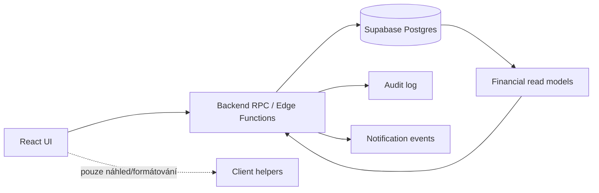

# Audit: co je ve frontendu a mělo by být v backendu

Datum: 2026-05-13

## Shrnutí

Portál používá React frontend jako silnou aplikační vrstvu nad Supabase. To je v pořádku pro čtení seznamů, formuláře a jednoduchou prezentaci, ale část finančních výpočtů, workflow přechodů a zaúčtování dnes běží v klientovi. To znamená, že stejná pravidla jsou rozprostřená v několika komponentách a nejsou atomicky chráněná na serveru.

Největší riziko je u výplat, realizací a režijních alokací. Frontend počítá dostupné částky, rozhoduje o platných stavech, skládá audit log a zapisuje více tabulek po sobě. Tyto operace by měly být backend RPC/Edge Function, ideálně v databázové transakci.

## Priorita 1: Výplaty a dostupné zůstatky

### Nález

Frontend v `src/components/PayoutDialog.jsx` skládá dostupné částky pro realizace z více tabulek:

- `realizations`
- `realization_profit_shares`
- `payout_items`
- `realizace_costs`
- `realizace_extra_costs`
- `attendance`

Relevantní rozsah: `src/components/PayoutDialog.jsx:193-311`.

Samotné uložení žádosti zapisuje `payouts` a následně `payout_items` z klienta: `src/lib/payoutRequestService.js:3-68`.

### Proč to má být backend

U výplaty nestačí validovat částku v UI. Dostupný zůstatek musí být ověřen při zápisu, protože mezi načtením formuláře a uložením může vzniknout jiná žádost, schválení nebo výplata. Dnes frontend spočítá dostupnost a potom jen vloží požadovanou částku. Bez serverové validace je možné vytvořit nekonzistentní stav, pokud RLS nebo constraints nepokrývají celou logiku.

### Doporučení

Vytvořit backend funkce:

- `get_payout_availability(p_member_id)` vrací projekty i realizace s jednotným výpočtem.
- `create_payout_request(payload)` atomicky ověří dostupnost a vloží `payouts` + `payout_items`.
- `update_payout_request(payload)` atomicky přepočítá dostupnost včetně právě editované žádosti.

Frontend má jen zobrazit výsledek a poslat požadované položky.

## Priorita 1: Workflow stavů výplat

### Nález

Stavové přechody výplat jsou v klientské službě `src/lib/payoutWorkflowService.js`. Například schválení, nahrání faktury a označení jako zaplaceno validují aktuální stav ve frontendu a pak volají `.update()`.

Relevantní rozsah: `src/lib/payoutWorkflowService.js:59-260`.

`src/components/Payouts.jsx:158-197` navíc skládá další workflow rozhodování a notifikace.

### Proč to má být backend

Stavový automat má být autoritativní. Frontend může mít UI ochrany, ale platný přechod musí rozhodnout backend. Jinak existuje riziko souběžných změn, chybějících audit záznamů nebo obejití pravidel přímým API voláním.

### Doporučení

Přesunout do backend funkcí:

- `approve_payout(payout_id, admin_note, approved_without_invoice)`
- `reject_payout(payout_id, admin_note)`
- `upload_payout_invoice(payout_id, invoice_path, invoice_name)`
- `mark_payout_paid(payout_id)`

Každá funkce má v transakci:

- ověřit aktuální stav,
- ověřit oprávnění,
- změnit stav,
- zapsat audit log,
- připravit notifikační event.

## Priorita 1: Režijní alokace a zaúčtování

### Nález

Schválení režijní alokace v `src/components/AllocationWorkflow.jsx` čte položky, maže staré `project_overhead_costs`, vkládá nové a mění stav měsíční alokace.

Relevantní rozsah: `src/components/AllocationWorkflow.jsx:42-149`.

Výpočet zbývající režie a uložení položek běží také ve frontendu: `src/components/MonthlyAllocation.jsx:200-275`.

### Proč to má být backend

Zaúčtování je účetní operace přes více tabulek. Má být atomické. Dnešní postup může skončit napůl hotový: staré náklady smazané, nové nevložené, stav nezměněný nebo audit nezapsaný.

### Doporučení

Vytvořit RPC:

- `save_overhead_allocation_draft(month, items)`
- `submit_overhead_allocation(allocation_id)`
- `approve_overhead_allocation(allocation_id, note)`
- `reopen_overhead_allocation(allocation_id, note)`

Backend má přepočítat alokace, kontrolovat překročení rozpočtů a zapisovat `project_overhead_costs` v jedné transakci.

## Priorita 2: Finanční výpočty projektu a realizace

### Nález

Sdílené výpočty jsou v `src/domain/financials.js`, ale pořád běží v klientovi:

- projektový budget: `src/domain/financials.js:10-29`
- odměna člena: `src/domain/financials.js:31-41`
- realizace: `src/domain/financials.js:72-121`

Tyto výpočty používá více obrazovek, například:

- detail projektu: `src/components/ProjectDetail.jsx:240-270`
- seznam projektů a odměny: `src/components/Projects.jsx:121-155`
- detail realizace: `src/components/RealizaceDetail.jsx:211-234`
- formulář výplaty: `src/components/PayoutDialog.jsx:270-311`

### Proč to má být backend

Výpočty odměn, dostupných částek a týmových rozpočtů jsou finanční pravda systému. Frontend může používat stejný výpočet jen pro náhled, ale autoritativní hodnota pro výplatu, reporting a audit musí vznikat na backendu.

### Doporučení

Přidat backend pohledy/RPC:

- `project_financial_summary(project_id)`
- `realization_financial_summary(realization_id)`
- `member_project_rewards(member_id)`
- `member_realization_rewards(member_id)`

Frontend pak nebude skládat výpočty z tabulek, ale zobrazí hotový souhrn.

## Priorita 2: Reporting agregace

### Nález

`src/components/RealizaceFinancials.jsx:36-61` načítá realizace a ručně sčítá celkové smlouvy, zisk, režie a týmový rozpočet. Navíc používá `calc.distributionAmount`, který není ve sdíleném výpočtu vracen. Správný název je dnes `teamBudget`.

### Dopad

Přehled realizací může ukazovat nulový nebo nesprávný týmový rozpočet. Zároveň je to další místo, kde vzniká odlišná finanční logika oproti detailu realizace a výplatám.

### Doporučení

Nahradit klientské sčítání backend funkcí:

- `realization_financial_overview(filters)`

Vrací agregace už po započtení nákladů, víceprací a oprávnění uživatele.

## Priorita 2: Generické zápisy do tabulek z UI

### Nález

Některé komponenty používají obecné handlery, které zapisují do tabulky podle parametru. Například `src/components/ProjectDetail.jsx:219-230` má `handleSaveGeneric(table, data, ...)` a `handleDeleteGeneric()`.

### Proč je to riziko

I když RLS může zápis omezit, aplikační pravidla jsou mimo backend. Není jasné, které tabulky mají jaké povinné vazby, audit a validace. Z pohledu údržby je těžší dohledat, kdo a proč mění projektové náklady, členy nebo odkazy.

### Doporučení

Postupně nahradit generické zápisy doménovými službami:

- `add_project_cost`
- `update_project_member`
- `delete_project_link`

U citlivých tabulek zapisovat audit log na backendu.

## Co může zůstat ve frontendu

Ve frontendu je v pořádku nechat:

- formátování měny a dat,
- řazení a filtrování již načtených seznamů,
- UI validace pro lepší uživatelský komfort,
- náhledové výpočty, pokud backend při zápisu znovu ověří pravdu,
- lokální stav formulářů,
- navigaci, taby, modaly, progress a prázdné stavy.

## Doporučený migrační plán

1. Stabilizovat výplaty:
   - vytvořit `get_payout_availability`,
   - vytvořit `create_payout_request`,
   - vynutit serverovou kontrolu dostupné částky.

2. Přesunout payout workflow:
   - schválení, zamítnutí, faktura, zaplacení do RPC/Edge Function,
   - audit log zapisovat serverově.

3. Přesunout režijní workflow:
   - schválení a znovuotevření alokace do transakční RPC,
   - odstranit klientské mazání/vkládání `project_overhead_costs`.

4. Vytvořit finanční read model:
   - `project_financial_summary`,
   - `realization_financial_summary`,
   - `member_rewards_summary`.

5. Zjednodušit frontend:
   - komponenty budou volat doménové služby,
   - `src/domain/financials.js` ponechat jen jako fallback/náhled nebo odstranit duplicitní výpočty.

6. Doplnit databázové testy:
   - překročení dostupné částky,
   - souběžné vytvoření výplaty,
   - editace existující výplaty,
   - schválení režie bez duplicit,
   - nemožné stavové přechody.

## Cílová architektura

## Doporučená hranice odpovědnosti

| Oblast | Dnes | Cíl |
| --- | --- | --- |
| Dostupnost výplaty | frontend + část RPC pro projekty | backend RPC pro projekty i realizace |
| Vytvoření výplaty | frontend insert do 2 tabulek | transakční backend funkce |
| Stav výplaty | klientská služba | backend stavový automat |
| Režijní schválení | frontend maže/vkládá účetní řádky | transakční backend funkce |
| Finanční souhrny | mix frontend výpočtů a RPC | backend read model |
| UI validace | frontend | zůstává, ale jen jako pomocná |

