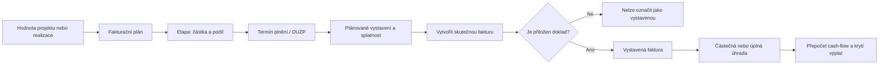

# Dílčí fakturace, termíny plnění a kontrola dokladů

## Účel

Projekt nebo realizaci lze rozdělit do plánovaných fakturačních etap. Každá etapa určuje očekávanou částku, termín plnění, plánované vystavení a splatnost. Skutečná faktura je samostatný záznam navázaný na etapu a obsahuje číslo dokladu, DUZP, data, částky, stav úhrady a nahraný soubor.

Plánovaná etapa nikdy sama nezvyšuje výnos ani dostupnost výplaty. Pro krytí výplat se používá jen skutečně uhrazená částka platné faktury.

## Audit původního stavu

Původní řešení evidovalo zálohové, dílčí, konečné faktury a dobropisy, ale neoddělovalo plán od skutečnosti. Chybělo:

- předem definované pořadí a počet dílčích plnění,
- termín splnění jednotlivých částí,
- vazba faktury na konkrétní etapu,
- povinná kontrola nahraného dokladu,
- informace o opožděných etapách,
- porovnání plánované fakturace s hodnotou zakázky.

Rizikem byla evidence vystavené nebo uhrazené faktury pouze jako ručně zadané částky bez ověřitelného dokumentu. Systém také neuměl jednoznačně určit, která část zakázky už byla fakturována.

## Cílový workflow



## Fakturační etapy

Každá etapa obsahuje:

- pořadové číslo,
- název a podmínku plnění,
- termín plnění,
- plánované datum vystavení,
- plánovanou splatnost,
- částku bez DPH, sazbu DPH a částku s DPH,
- volitelný procentní podíl z hodnoty zakázky,
- stav etapy.

Etapy lze vytvořit jednotlivě nebo automaticky rozdělit zbývající hodnotu zakázky do 1 až 24 částí. Automatické rozdělení je pouze výchozí návrh; každou etapu lze upravit.

## Skutečné faktury

Nová faktura ve stavu jiném než `Koncept` nebo `Stornovaná` musí mít:

- číslo faktury,
- datum plnění (DUZP),
- datum vystavení,
- datum splatnosti,
- částku a DPH,
- nahraný dokument nebo ověřitelný externí odkaz.

Jedna aktivní etapa může mít nejvýše jednu aktivní fakturu. Stornovaná faktura vazbu uvolní. Faktura mimo plán je povolená pro dobropisy, mimořádná plnění a historické opravy.

## Výpočty

```text
plánováno = součet aktivních fakturačních etap s DPH
odchylka plánu = plánováno - hodnota zakázky

vyfakturováno =
  vystavené + částečně uhrazené + uhrazené + po splatnosti
  - dobropisy

uhrazeno = přijaté úhrady - uhrazené dobropisy

pokrytí výplat = min(100 %, uhrazeno / hodnota zakázky)
```

Koncepty a stornované faktury nevstupují do vyfakturované částky. Plánované etapy nevstupují do krytí výplat.

## Kontroly

- Backend odmítne vystavenou fakturu bez povinných dat nebo dokladu.
- Uhrazená částka nesmí překročit hodnotu faktury.
- Částečná úhrada musí být vyšší než nula a nižší než celková hodnota faktury.
- Faktura a etapa musí patřit ke stejnému projektu nebo realizaci.
- Aktivní etapu nelze spojit se dvěma aktivními fakturami.
- Splatnost etapy nesmí být před plánovaným vystavením.
- Souhrn upozorňuje na odchylku fakturačního plánu od hodnoty zakázky.
- Souhrn upozorňuje na etapy po plánovaném termínu a starší faktury bez dokladu.
- Smazání a změny etap i faktur se zapisují do `audit_logs` včetně uživatele a původních/nových hodnot.

## Historická kompatibilita

Historické faktury vytvořené před zavedením povinných příloh se nezablokují. V přehledu se ale označí `Chybí doklad`. Při běžné kontrole má administrátor doklad doplnit. Nové vystavené faktury už bez dokladu uložit nelze.

## Oprávnění a diskrétnost

- Celý fakturační plán, částky, dokumenty a úhrady vidí a spravuje pouze administrátor.
- Běžný uživatel nečte tabulky fakturace ani finanční dokumenty.
- Do přehledu výplat dostává běžný uživatel jen svůj nárok, vlastní rezervace a obecný indikátor pokrytí; nevidí cizí částky ani kompletní fakturační data.
- Výplata nad doporučený limit z úhrad zůstává označena pro administrátorskou kontrolu.

## Doporučený provoz

1. Při založení zakázky administrátor nastaví fakturační etapy podle smlouvy.
2. Před termínem plnění projektový manažer předá podklady finančnímu oddělení.
3. Administrátor vytvoří fakturu přímo z etapy a nahraje originální doklad.
4. Po přijetí platby zapíše částečnou nebo úplnou úhradu.
5. Systém přepočítá krytí zakázky a doporučený limit výplat.
6. Dobropis se eviduje samostatně a snižuje vyfakturovanou i uhrazenou hodnotu.

Finální účetní a daňové posouzení DUZP, sazby DPH a režimu konkrétního plnění zůstává na odpovědné účetní osobě.
