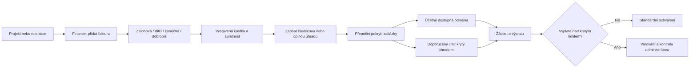

# Dílčí fakturace a krytí výplat

## Cíl

U projektu i realizace oddělujeme dvě hodnoty:

- **Účetně dostupná odměna**: nárok vypočtený z rozpočtu, odměn, nákladů a již rezervovaných nebo vyplacených částek.
- **Část krytá úhradami**: doporučená maximální výplata podle toho, jakou část zakázky zákazník skutečně uhradil.

Výchozí režim je varovný. Systém neblokuje staré zakázky bez evidence fakturace, ale jasně je označí.

Procento pokrytí porovnává uhrazené částky faktur včetně DPH s celkovou hodnotou uloženou u projektu nebo realizace. U starších záznamů musí administrátor ověřit, že hodnota zakázky používá stejný cenový základ. V další etapě lze tento údaj převést na explicitní nastavení ceny s/bez DPH.

## Workflow



## Stavy fakturace

| Stav | Význam |
|---|---|
| Neevidováno | U starší zakázky nebyly faktury doplněny. Výplata není blokována, ale systém nemůže ověřit cash-flow. |
| Nevyfakturováno | Evidence existuje, ale nebyla vystavena platná faktura. |
| Částečně fakturováno | Součet vystavených faktur je nižší než hodnota zakázky. |
| Čeká na úhradu | Zakázka je vyfakturována, ale zákazník dosud neuhradil. |
| Částečně uhrazeno | Byla uhrazena pouze část hodnoty zakázky. |
| Plně uhrazeno | Uhrazená částka pokrývá celou hodnotu zakázky. |

## Výpočty

```text
pokrytí úhradami = min(100 %, uhrazeno / hodnota zakázky)

doporučený krytý limit člena =
  min(
    účetně dostupná odměna,
    celková odměna člena × pokrytí úhradami
      - ostatní rezervované a vyplacené částky člena
  )
```

Příklad:

- hodnota zakázky: 1 000 000 Kč,
- uhrazeno: 400 000 Kč,
- pokrytí: 40 %,
- celková odměna člena: 100 000 Kč,
- již rezervováno: 10 000 Kč,
- účetně zbývá: 90 000 Kč,
- krytý limit: `100 000 × 40 % − 10 000 = 30 000 Kč`.

Uživatel vidí účetní zůstatek 90 000 Kč a doporučený krytý limit 30 000 Kč. Vyšší žádost je označena varováním.

## Oprávnění a audit

- Celou fakturaci, částky zakázky a úhrady vidí pouze administrátor.
- Běžný člen týmu vidí pouze svou odměnu, svůj dostupný zůstatek, procento pokrytí a obecné upozornění.
- Každé vytvoření, změna nebo odstranění fakturačního záznamu se zapisuje do `audit_logs` včetně uživatele a původních/nových hodnot.
- Stornovaná faktura nevstupuje do výpočtu. Dobropis snižuje vyfakturovanou a uhrazenou částku.

## Další etapa

Po doplnění historie fakturace lze zapnout přísný režim, ve kterém backend nepovolí vytvoření nebo schválení výplaty nad krytý limit. Do té doby zůstává kontrola varovná, aby se neblokovaly starší zakázky.
