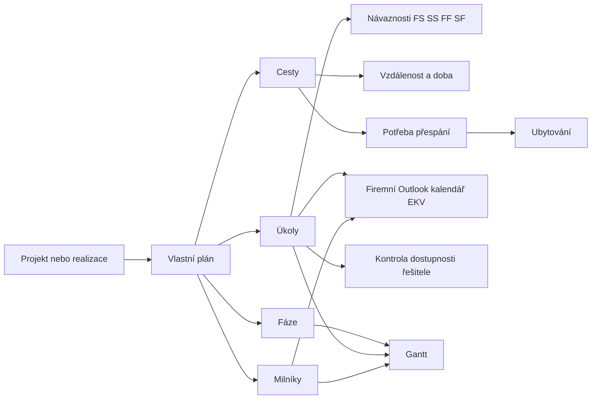

# Plánovací board projekce a realizací

## Účel

Modul sjednocuje časové plánování projekce a realizací, ale zachovává jejich oddělené datové a přístupové hranice. Portfolio obrazovka `/planning` slouží pouze k přepínání mezi dostupnými harmonogramy. Každý projekt a každá realizace mají vlastní plán, položky, logistiku a audit změn.

Finanční hodnoty nejsou součástí tohoto modulu. Oprávnění vycházejí z existujícího přístupu k projektu nebo realizaci a nemění pravidla diskrétnosti finančních údajů.

## Workflow

1. Po založení projektu nebo realizace vznikne automaticky prázdný plán.
2. Existující projektové úkoly se při migraci převedou do plánu.
3. Projektové úkoly a plánovací úkoly se synchronizují oběma směry.
4. Uživatel vytvoří fáze, úkoly a milníky, nastaví termíny, řešitele a průběh.
5. V Ganttu může oprávněný uživatel přesunout termín, změnit délku nebo vytvořit návaznost.
6. Pro výjezdy se eviduje trasa, datum, vzdálenost, doba cesty a potřeba přespání.
7. Ubytování se eviduje samostatně s termínem, stavem a číslem rezervace.
8. Důležité změny položek, návazností, cest a ubytování se zapisují do auditního logu plánu.

## Microsoft 365 kalendář

- EKVPortal zůstává zdrojem pravdy. První verze synchronizuje termíny jedním směrem z plánu do Outlooku.
- Synchronizaci lze zapnout pro úkol nebo milník i bez přiřazeného pracovníka. Fáze se do kalendáře neposílají.
- Událost vzniká v hlavním kalendáři sdíleného mailboxu nastaveného jako `planning_company_calendar_mailbox`. Tento kalendář se v Microsoft 365 sdílí celé firmě.
- Událost obsahuje název, řešitele, popis a odkaz do portálu. Neobsahuje rozpočty, mzdy ani jiné finanční údaje.
- Změna názvu, termínu, stavu nebo řešitele aktualizuje existující událost. Vypnutí synchronizace nebo zrušení položky událost odstraní.
- Tlačítko `Ověřit dostupnost` čte free/busy stav schránky přes Microsoft Graph a upozorní na kolize před uložením termínu.
- Osobní schránka pracovníka se používá pouze pro kontrolu dostupnosti. Pokud se jeho Microsoft 365 UPN liší, použije se `members.microsoft_calendar_email`.
- Akce `Synchronizovat celý plán` znovu publikuje všechny zapnuté úkoly a milníky aktuálního plánu a převede případné staré osobní události do firemního kalendáře.
- Stav a chyba synchronizace jsou dohledatelné v `planning_calendar_links` a audit v `planning_calendar_sync_log`.

## Datový model

- `planning_plans`: jeden plán pro jeden projekt nebo jednu realizaci.
- `planning_items`: fáze, úkoly a milníky.
- `planning_dependencies`: návaznosti mezi položkami.
- `planning_assignments`: další řešitelé a plánované kapacity.
- `planning_locations`: normalizovaná místa pro budoucí routing.
- `planning_travel_segments`: cesty a ruční výpočet vzdálenosti/doby.
- `planning_accommodations`: ubytování a rezervace.
- `planning_baselines`: připravený prostor pro verzované baseline plánu.
- `planning_change_log`: audit důležitých změn.
- `planning_calendar_links`: vazba položky plánu na konkrétní Outlook událost včetně cíle `personal` (legacy) nebo `company`.
- `planning_calendar_sync_queue`: odolná fronta změn pro opakování neúspěšné synchronizace.
- `planning_calendar_sync_log`: audit kontrol dostupnosti a synchronizací.

## Oprávnění

- Čtení plánu vyžaduje přístup k příslušnému projektu nebo realizaci.
- Editace vyžaduje `can_edit` pro modul `projects` nebo `realizace`.
- Portfolio RPC vrací jen plány, které smí přihlášený uživatel vidět.
- Plán neobsahuje náklady, mzdy ani odměny.

## Následující etapy

- Routing přes Mapy.com API a automatické dopočítání km a času.
- Kontrola kolizí kapacit řešitelů napříč plány.
- Ukládání a porovnání baseline harmonogramu.
- Notifikace blížících se milníků a zpoždění.
- Export harmonogramu do PDF/XLSX a kalendáře.
- Schvalovací workflow cest a ubytování včetně nákladů pouze pro oprávněné role.
