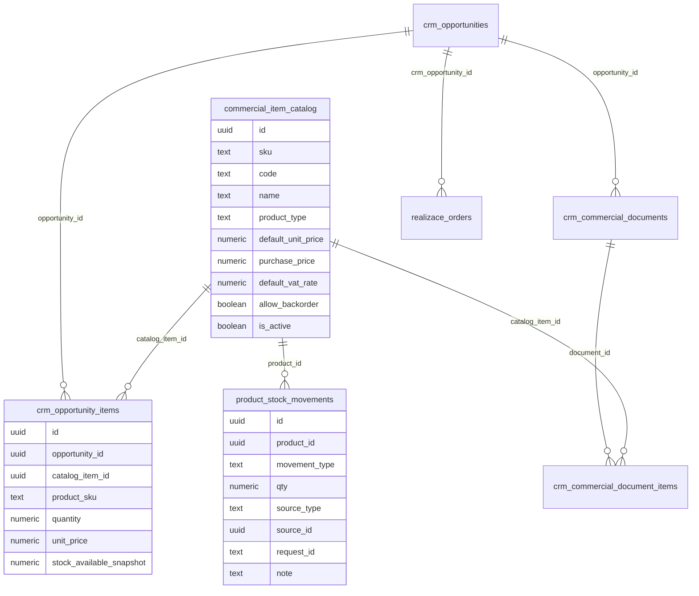
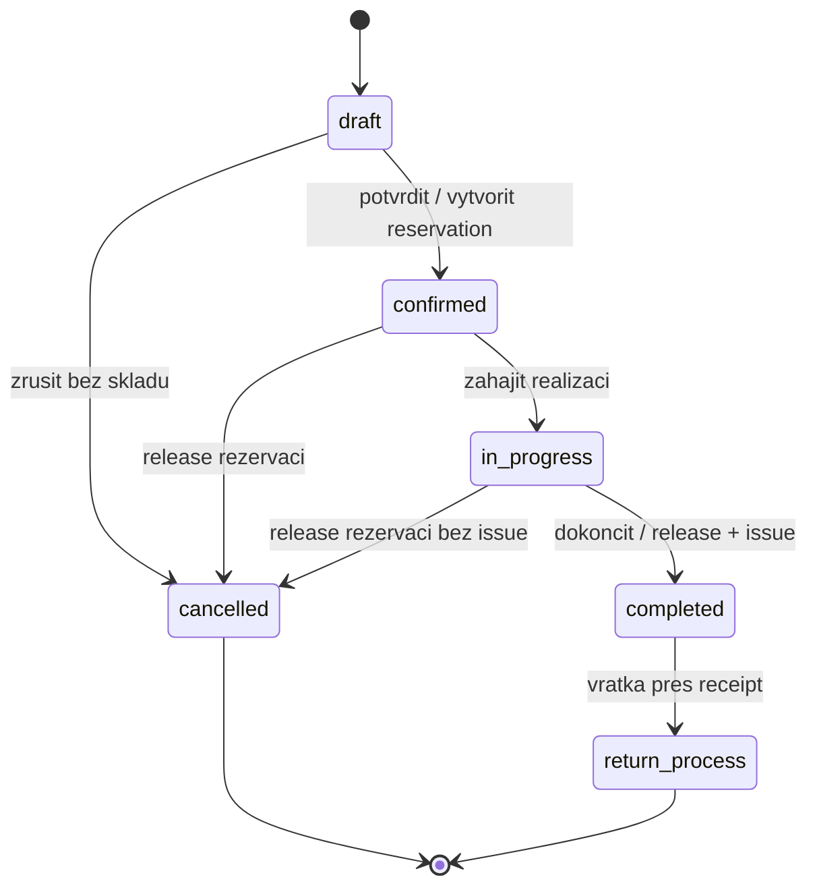

# Produktovy system, CRM a sklad - implementacni plan pro EKVPortal

Tento dokument prevadi obecny workflow z `product_db_workflow.md` do konkretniho planu pro stavajici EKVPortal. Navazuje na aktualni stav portalu:

- `commercial_item_catalog` uz existuje jako zaklad katalogu polozek.
- `crm_opportunity_items` uz drzi polozky obchodniho pripadu.
- `crm_commercial_document_items` drzi polozky nabidek/objednavek, pokud je u dokumentu vypnuta synchronizace s OP.
- Realizacni objednavky uz umi nacitat katalog pres `RealizaceOrderForm`.
- CRM nesmi menit sklad. CRM ma pouze cist katalog a informativni dostupnost.

## 1. Cil implementace

Vybudovat jeden centralni produktovy katalog, ktery bude slouzit pro:

- CRM obchodni pripady, nabidky a objednavky.
- Realizacni modul a skladove pohyby.
- Budouci web/katalog/e-shop.
- Budouci fakturaci a ucetni exporty.

Zakladni pravidlo: CRM pracuje s produkty a cenami obchodne, ale nikdy nevytvari skladovy pohyb. Skladove dopady vznikaji az v realizaci.

## 2. Mapovani na stavajici system

| Obecny pojem | EKVPortal dnes | Cilovy stav |
| --- | --- | --- |
| Product | `commercial_item_catalog` | rozsirit na plny produktovy katalog |
| CRM Opportunity Item | `crm_opportunity_items` | ponechat, doplnit snapshot ceny/skladu |
| Offer/Order Item | `crm_commercial_document_items` | ponechat pro dokumenty s vypnutym sync |
| Realization Order | `realizace_orders` | pouzit jako zaklad realizacni zakazky / objednavky |
| StockMovement | chybi | nova tabulka `product_stock_movements` |
| Reservation | chybi | nova tabulka `product_stock_reservations` nebo pohyby typu `reservation/release` |
| Product Admin UI | chybi / roztrousene | novy modul `Produkty` + skladove podsekce |

## 3. Navrhovany datovy model

### 3.1 Rozsireni `commercial_item_catalog`

Stavajici tabulka zustane centralnim katalogem. Doplni se:

```sql
alter table public.commercial_item_catalog
  add column if not exists sku text,
  add column if not exists product_type text not null default 'service',
  add column if not exists purchase_price numeric(14,2) not null default 0,
  add column if not exists currency text not null default 'CZK',
  add column if not exists stock_min_qty numeric null,
  add column if not exists warehouse_location text null,
  add column if not exists allow_backorder boolean not null default false,
  add column if not exists archived_at timestamptz null,
  add column if not exists updated_by uuid null;
```

Pravidla:

- `product_type in ('manufactured', 'service')`.
- `sku` bude hlavni importni a integracni klic.
- `code` muze zustat obchodni kod kvuli kompatibilite, ale postupne se sjednoti se `sku`.
- `default_unit_price` zustava prodejni cena.
- `purchase_price` je nakupni/nakladova cena.
- Pro `service` se skladova pole v UI skryji a skladove pohyby se nevytvareji.

### 3.2 Nova tabulka `product_stock_movements`

```sql
create table public.product_stock_movements (
  id uuid primary key default gen_random_uuid(),
  product_id uuid not null references public.commercial_item_catalog(id),
  movement_type text not null,
  qty numeric not null,
  source_type text not null,
  source_id uuid null,
  request_id text null,
  unit_cost numeric(14,2) null,
  note text null,
  created_by uuid null,
  created_at timestamptz not null default now(),
  constraint product_stock_movements_type_check
    check (movement_type in ('receipt', 'issue', 'reservation', 'release', 'adjustment')),
  constraint product_stock_movements_request_unique
    unique (source_type, source_id, request_id)
);
```

Pravidla:

- `receipt`, `adjustment` a manualni korekce smi delat sklad/realizace/admin.
- CRM nema zadne write policy na tuto tabulku.
- `request_id` chrani pred dvojim zapisem pri retry.

### 3.3 Nova view `product_stock_status`

Skladova dostupnost se nebude ukladat jako rucni hodnota. Pro CRM a web bude view:

```sql
create or replace view public.product_stock_status
with (security_invoker = true)
as
select
  p.id as product_id,
  coalesce(sum(case when m.movement_type in ('receipt', 'adjustment', 'issue') then m.qty else 0 end), 0) as stock_qty,
  coalesce(sum(case when m.movement_type = 'reservation' then m.qty when m.movement_type = 'release' then -m.qty else 0 end), 0) as stock_reserved_qty,
  coalesce(sum(case when m.movement_type in ('receipt', 'adjustment', 'issue') then m.qty else 0 end), 0)
    - coalesce(sum(case when m.movement_type = 'reservation' then m.qty when m.movement_type = 'release' then -m.qty else 0 end), 0) as stock_available_qty
from public.commercial_item_catalog p
left join public.product_stock_movements m on m.product_id = p.id
group by p.id;
```

Poznamka: `issue` bude zapisovat zaporne `qty`, takze se scita s fyzickym stavem.

### 3.4 Snapshoty v CRM polozkach

Do `crm_opportunity_items` a `crm_commercial_document_items` doplnit snapshotova pole:

```sql
alter table public.crm_opportunity_items
  add column if not exists product_sku text null,
  add column if not exists product_type text null,
  add column if not exists stock_available_snapshot numeric null,
  add column if not exists catalog_price_snapshot numeric(14,2) null;
```

Stejne pro `crm_commercial_document_items`.

Ucel:

- Historie nabidky zustane stabilni i po zmene produktu.
- CRM muze ukazat varovani, pokud je aktualni sklad jinak nez v dobe pripravy nabidky.

## 4. ER diagram



## 5. Stavovy diagram realizacni zakazky a skladu



## 6. Procesy v EKVPortalu

### 6.1 Sprava produktu

Modul `Produkty`:

- seznam produktu s filtrem `active/archive`, `manufactured/service`, kategorie, skladova dostupnost,
- detail produktu,
- zalozeni/editace produktu,
- import z Excelu podle `sku`,
- archivace misto mazani,
- zalozka `Sklad` jen pro `manufactured`.

### 6.2 CRM vyber produktu

V CRM:

- produkt se vybira z `commercial_item_catalog`,
- zobrazit `stock_available_qty` z `product_stock_status`,
- zobrazit badge:
  - `Skladem`,
  - `Neni skladem`,
  - `Na objednavku`,
  - `Sluzba`,
- pri pridani do OP ulozit `catalog_item_id` + snapshot ceny a dostupnosti,
- CRM nevytvari zaznam v `product_stock_movements`.

### 6.3 Nabidka a objednavka v CRM

Stavajici princip zustava:

- OP ma master polozky v `crm_opportunity_items`.
- Nabidka/objednavka ma sync zapnuty = bere OP polozky.
- Sync vypnuty = dokument ma vlastni `crm_commercial_document_items`.
- Generovani dokumentu bere snapshoty a aktualni vazby.

### 6.4 Konverze OP do realizace

Novy command/action:

`POST /api/crm/opportunities/{id}/convert-to-realization`

Chovani:

- povoleno jen pokud OP je `won` nebo rucne potvrzeny stav,
- vytvori `realizace_orders` se statusem `draft`,
- zkopiruje polozky z `crm_opportunity_items`,
- ulozi `crm_opportunity_id`,
- nevytvari skladovy pohyb.

### 6.5 Potvrzeni realizace

Pri prechodu realizace `draft -> confirmed`:

- pro kazdou `manufactured` polozku zkontrolovat dostupnost,
- pokud `allow_backorder = false`, nesmi vzniknout rezervace nad dostupnost,
- zapsat `product_stock_movements` typu `reservation` s kladnym `qty`,
- `service` polozky ignorovat pro sklad.

### 6.6 Dokonceni realizace

Pri `in_progress -> completed`:

- pro kazdou rezervovanou `manufactured` polozku:
  - zapsat `release` s kladnym `qty`,
  - zapsat `issue` se zapornym `qty`,
- po dokonceni muze fakturace cist data z realizace.

## 7. Bezpecnostni model

| Modul / role | Produkty | Skladove pohyby | CRM polozky | Realizace |
| --- | --- | --- | --- | --- |
| Admin | full | full | full | full |
| Produktovy spravce | full | receipt/adjustment | read | read |
| Skladnik / realizace | read | full pro realizaci | read | edit |
| Obchodnik / CRM | read | no write | edit CRM | read |
| Web/katalog | read active only | read available only | no | no |
| Fakturace | read | read | read | read completed |

RLS doporuceni:

- `commercial_item_catalog`: CRM read, realizace read, settings/admin write.
- `product_stock_movements`: CRM read only aggregate view, no direct insert/update/delete.
- `product_stock_status`: read pro CRM/web/realizace.
- Write operace skladu idealne pres SQL RPC/Edge Function, ne primy insert z UI.

## 8. OpenAPI navrh

```yaml
openapi: 3.0.3
info:
  title: EKVPortal Product API
  version: 0.1.0
paths:
  /products:
    get:
      summary: List products for CRM/catalog
      parameters:
        - in: query
          name: q
          schema: { type: string }
        - in: query
          name: type
          schema: { type: string, enum: [manufactured, service] }
        - in: query
          name: active
          schema: { type: boolean }
      responses:
        "200":
          description: Product list with stock availability
    post:
      summary: Create product
      security: [{ role: [settings.admin, product.write] }]
  /products/{id}:
    patch:
      summary: Update product metadata and prices
      security: [{ role: [settings.admin, product.write] }]
  /products/{id}/archive:
    post:
      summary: Archive product without deleting history
  /stock/movements:
    post:
      summary: Create stock movement
      description: Only realization/warehouse/admin may call this.
      security: [{ role: [warehouse.write, realizace.edit] }]
  /stock/status:
    get:
      summary: Read product availability
  /crm/opportunities/{id}/convert-to-realization:
    post:
      summary: Convert won CRM opportunity to realization order draft
  /realization-orders/{id}/confirm:
    post:
      summary: Confirm realization order and reserve stock
  /realization-orders/{id}/complete:
    post:
      summary: Complete order, release reservations and issue stock
```

## 9. Migracni plan

### Faze A - schema bez zmen UI

1. Rozsirit `commercial_item_catalog`.
2. Pridat `product_stock_movements`.
3. Pridat `product_stock_status` view.
4. Doplneni snapshot poli do CRM item tabulek.
5. Nastavit RLS.

### Faze B - migrace dat

1. Zkopirovat existujici katalogove polozky.
2. Doplnit `sku = coalesce(code, generated code)`.
3. Nastavit `product_type = service` pro polozky bez skladove logiky.
4. Pro znamy skladovy sortiment nastavit `manufactured`.
5. Importovat pocatecni sklad jako `adjustment` s `source_type = 'initial_import'`.

Import musi byt idempotentni podle `sku`.

### Faze C - UI a procesy

1. Produktovy modul.
2. CRM product picker s dostupnosti.
3. Konverze OP do realizace.
4. Potvrzeni realizace a rezervace.
5. Dokonceni realizace a vydej.

## 10. Roadmapa

### MVP

- Rozsireny produktovy katalog.
- Produktovy seznam a detail.
- CRM umi pridat produkt z katalogu do OP.
- CRM zobrazuje dostupnost, ale nesaha na sklad.
- Skladove pohyby existuji a jdou zadat manualne.
- Realizace umi pri potvrzeni vytvorit rezervaci.
- Build/lint + zakladni RLS.

### v1

- Plna konverze OP -> realizace.
- Stavovy workflow realizace se skladovymi dopady.
- Inventura a korekce.
- Import produktu z Excelu.
- Audit log zmen produktu a skladu.
- Varovani v CRM pri archivovanem produktu nebo nedostupnosti.

### v2

- Web/katalog API.
- Eventy `product.updated`, `stock.changed`.
- Fronta/retry pro synchronizace.
- Vice skladu, serie/sarze, variantni produkty.
- Fakturacni export z completed realizaci.

## 11. Akceptacni kriteria pro EKVPortal

- Produkt lze zalozit jako `manufactured` i `service`.
- `service` nikdy negeneruje skladovy pohyb.
- CRM pridani produktu do OP negeneruje `product_stock_movements`.
- CRM u polozky ukazuje aktualni dostupnost a snapshot dostupnosti.
- Realizace `draft -> confirmed` vytvori rezervace.
- Realizace `completed` uvolni rezervace a vytvori vydej.
- Zruseni potvrzene realizace uvolni rezervace bez vydeje.
- Archivovany produkt zustava v historickych nabidkach, ale nelze ho nově konvertovat do realizace bez potvrzeni/admin override.
- Import podle `sku` je opakovatelny.
- RLS neumozni CRM zapis do skladu.

## 12. Doporucena implementacni posloupnost

1. Vytvorit migraci `product_catalog_stock_core`.
2. Pridat jednoduchy produktovy modul do menu CRM/Obchod.
3. Nahradit rucni psani polozek v OP product pickerem z katalogu, rucni polozky ponechat jako fallback.
4. Doplnit dostupnost do OP a nabidky.
5. Implementovat konverzi OP do realizace bez skladoveho dopadu.
6. Implementovat potvrzeni realizace s rezervaci.
7. Implementovat dokonceni realizace s vydejem.
8. Az potom resit web/katalog a fakturacni export.

