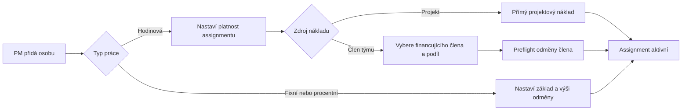
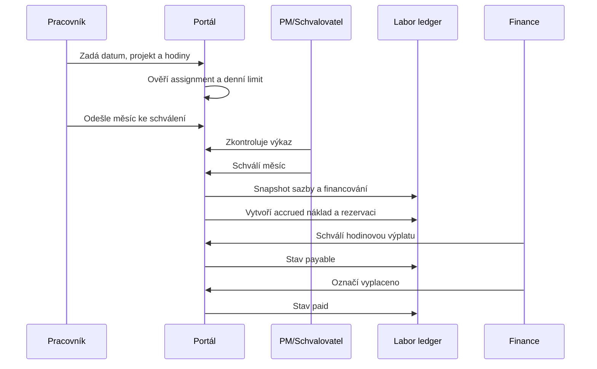
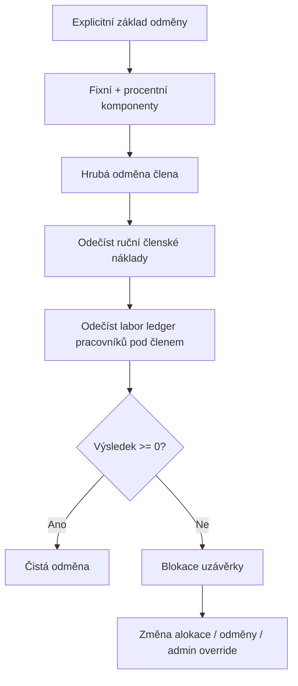
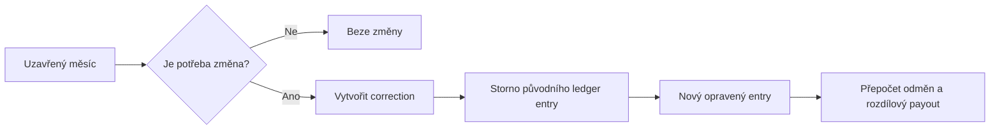

# Workflow práce, hodinových mezd a týmových odměn

## Cíl

Každá odpracovaná hodina musí mít právě jeden finanční dopad a musí být dohledatelné:

- kdo práci provedl,
- na jakém projektu nebo realizaci,
- jaká sazba platila v den práce,
- kdo práci financuje,
- kdy náklad vznikl, kdy byl schválen a kdy byl zaplacen,
- jak práce ovlivnila odměnu člena týmu a marži projektu.

## Základní princip

```text
Pracovník              dostane hodiny × sazba
Projekt                eviduje skutečný pracovní náklad
Financující člen       nese sjednanou část nákladu ve své odměně
Společný týmový pool   nese pouze nezafinancovaný zbytek
```

Pracovní náklad se neztrácí z účetního pohledu. „Financování z odměny člena“ pouze určuje, že stejná částka nesmí znovu snížit společný týmový pool.

## Role

| Role | Odpovědnost |
|---|---|
| Projektový manažer | přiřazení osoby, platnost, typ odměny a zdroj financování |
| Pracovník | pravdivé zadání hodin na povolený assignment |
| Schvalovatel docházky | kontrola data, hodin, projektu, sazby a zdroje financování |
| Finance/admin | kontrola rezervy, faktury, payoutu, korekcí a uzávěrky |
| Člen týmu | vidí hrubou odměnu, pracovníky hrazené z jeho odměny a čistou odměnu |

## Workflow přiřazení



### Kontroly při uložení

1. Pracovník a financující člen nesmí být stejná osoba.
2. Financující člen musí být na stejném projektu a mít fixní nebo procentní odměnu.
3. Platnost `do` nesmí být před platností `od`.
4. Sponzorovaný podíl musí být 0-100 %.
5. Bez hodinové role nelze nastavit hodinové financování.

## Workflow docházky a vzniku nákladu



### Okamžik finančního dopadu

- `draft/submitted`: pouze operativní expozice, bez uzavřeného nákladu,
- `approved attendance`: vznik akruálního nákladu a rezervace,
- `approved/invoice_uploaded payout`: závazek k úhradě,
- `paid`: změna cash-flow, nikoliv nový náklad.

## Workflow výpočtu odměny člena



## Příklad

| Položka | Částka |
|---|---:|
| Hrubá odměna člena | 50 000 Kč |
| Pracovník: 40 h × 500 Kč | 20 000 Kč |
| Financování z člena | 100 % |
| Čistá odměna člena | 30 000 Kč |
| Výplata pracovníka | 20 000 Kč |
| Celková týmová kompenzace | 50 000 Kč |
| Dodatečný dopad do společného poolu | 0 Kč |

## Opravy a uzávěrka



Historické řádky se nepřepisují. Každá korekce musí obsahovat původní záznam, rozdíl, důvod, autora a čas.

## Finanční obrazovka projektu

Finanční přehled má zobrazovat čtyři oddělené pohledy:

1. **Plán** - smluvní cena, plánované náklady, týmový pool a cílová marže.
2. **Akruál** - schválené materiály, práce, subdodávky a odměny bez ohledu na zaplacení.
3. **Závazky** - schválené výplaty a faktury čekající na úhradu.
4. **Cash** - skutečně přijaté a zaplacené částky.

U každého člena týmu:

```text
Hrubá odměna
- běžné přiřazené náklady
- hodinová práce podřízených pracovníků
= čistá odměna
- rezervováno / vyplaceno
= zbývá k výplatě
```

## Provozní pravidla

- Nový historický assignment se nesmí vložit do již uzavřeného měsíce bez correction workflow.
- Změna sazby platí pouze od zadaného data.
- Odstranění člena s navázanou docházkou se nahradí ukončením platnosti.
- Projekt nelze uzavřít s nealokovanou schválenou prací, zápornou odměnou člena nebo otevřeným payoutem.
- Admin override musí obsahovat důvod a určit, kdo ponese deficit.

## Technické zdroje pravdy

- assignment: `project_members` / `realizace_team_members`,
- sazba: `member_hourly_rate_history`,
- čas: `attendance`,
- schválený finanční snapshot: `labor_cost_ledger`,
- výplata: `hourly_payout_requests`,
- týmová odměna: `project_members` / `realization_profit_shares`,
- audit: `audit_logs` a workflow audit.
